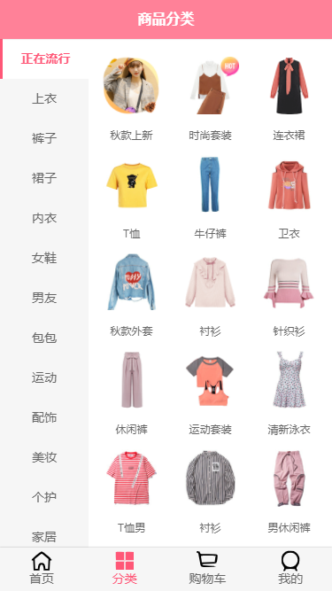
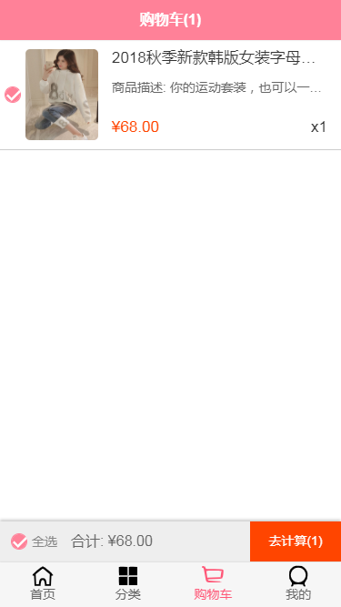

# supermall

## Project setup
```
npm install
```

### Compiles and hot-reloads for development
```
npm run serve
```

### Compiles and minifies for production
```
npm run build
```

### Customize configuration
See [Configuration Reference](https://cli.vuejs.org/config/).

API接口
采用了爬虫去爬蘑菇街的数据。存放在数据库里面，搭建一个本地服务器，最后去访问数据。
接口来自[mappAPI](https://github.com/constown/mallAPI)

使用方法：
- 1.安装node
- 2.安装mysql
- 3.建立supermall数据库
- 4.打开项目运行
- 5.修改文件 mysql.js服务器连接,
- 6.运行项目命令：npm run start

运行后，在运行supermall时 端口号baseURL设置为’http://localhost:3000‘就行了

因为是后端项目是本地运行的，这里是运行截图
首页浏览商品


点击商品进入细节页，可以选择进入购物车




